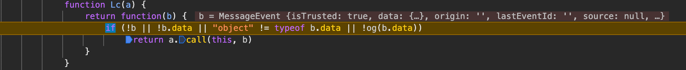
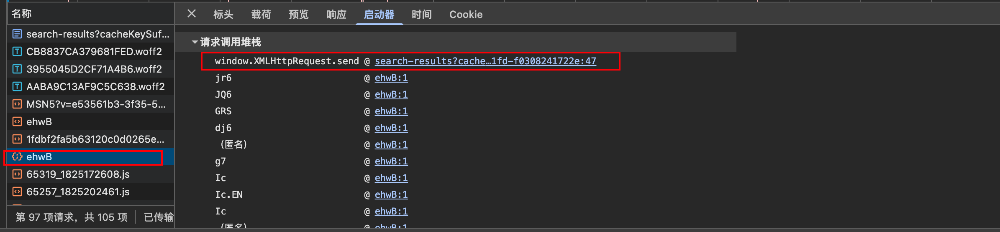
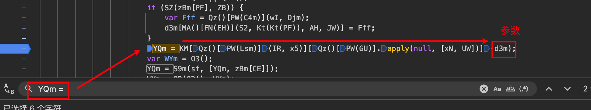
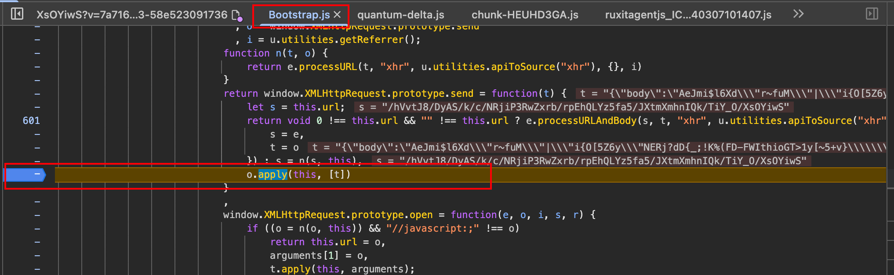
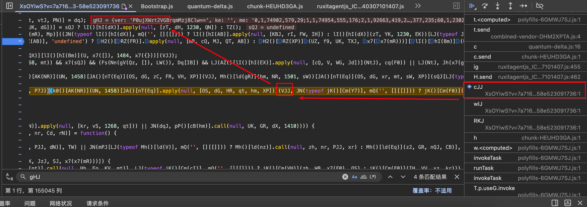
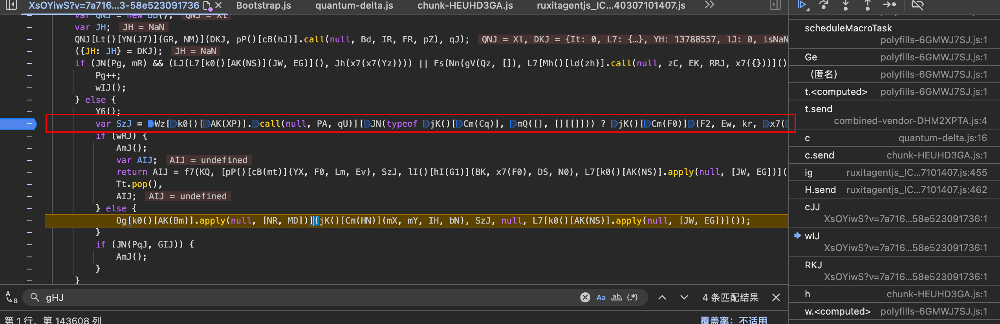

# 两周解开 Akamai 两阶段挑战：一次完整的逆向研究记录

[English](public-akamai-two-stage-challenge-research.md) | **简体中文**

<!-- TRANSLATION-SOURCE: canonical -->
<!-- TRANSLATION-SYNC: 2026-08-16 -->

> In August 2026, Akamai Bot Manager rolled out a refreshed build. This is a write-up of how I reverse engineered its two-stage sensor challenge in about two weeks — including the wrong turns, the methodology that survived build rotation, and why protocol shape matters as much as the algorithm. Methodology only: no runnable bypass, no live-session data.

## 为什么写这篇

网上关于 Akamai 的资料大多停留在"补环境生成 sensor_data"，而这次更新后的实际情况要复杂得多：短报不再决定成败，判定权移到了一段体积更大、结构完全不同的长报上。这篇文章记录我从未知到通过的全过程，重点不是"答案"（字段名随构建轮换，答案会过期），而是**每一步的判断依据**——包括三次走错和怎么发现的。

## 1. 起点：门禁在哪

目标是一个 GraphQL 查询接口。它没有任何签名头，裸发 403，所有门禁都在 Cookie 里。把 Cookie 值放进 Network 面板逐级回溯，会发现 `_abck` / `bm_*` 全部由几段路径随机的大脚本驱动产生。

于是问题收敛为：**把这几段脚本在本地跑起来，产出和浏览器一致的报文。**

## 2. 跟栈的第一课：我先走错了

处理掉无限 debugger（特征是一个 eval 里的埋点变量名）之后开始跟栈。我最初顺着一段核心脚本往 worker message 方向追，花了半天分析它的消息分发函数：



后来发现这条链根本到不了目标请求——它是页面自己的埋点系统。纠正方法很朴素：**回到目标 POST 的第一个栈帧，从那里往下走**。



从第一栈逐层上跳，每层看局部变量，最终在明文组装处停住——Scope 里是一个 82 元素的键值对数组，这就是第一阶段 `sensor_data` 的明文：



这条经验后来反复验证：逆向这类混淆脚本，"找对起点"比"分析能力"更决定效率。

## 3. 第一阶段：传统 sensor_data 路线

拿到明文后走的是经典路子：脚本搬进 Node 的 VM，写最小浏览器环境，拿本地明文和浏览器逐字段 diff，缺什么补什么。

有两个值得记的点：

- **报错文本会进明文**。某个 Web API 缺失时，脚本不是跳过，而是把 TypeError 的文本塞进报文的异常字段——这类差异优先级最高，因为服务器一眼就能看出环境异常；
- **时间类字段要用"同环境对照"排除**。有几个字段差了 30 倍，查了很久环境。后来让浏览器清除断点完整跑一遍重新抓取，数值和 Node 完全一致——差异是调试器本身造成的观测污染，不是环境问题。

这一阶段的坑大多不是"算法难"，而是"观测方式不对"。这个主题后面还会反复出现。

## 4. 停在 -1 的 _abck

第一阶段补齐后，短报 POST 能拿到 201（注册成功的响应），但 `_abck` 一直停在 `~-1~`（未验证态），翻不成真实页面的 `~0~`，业务接口照样 403。

回头逐帧看 HAR，才注意到还有**第二段脚本**（URL 特征不同），以及一枚 Cookie 的长度存在阶梯：只有在 POST 过一段 `{"body":"..."}` 格式的"长报"之后，它才升到可用档位。结论：**短报只是注册，真正的验证在第二段。**

这是整个研究的第一个转折点：投入了两周的"传统路线"只解决了三分之一的问题。

## 5. 转折：一个反例实验

当时的主流猜想是"Cookie 要凑齐一套才放行"。我做了一个反例实验：把浏览器里截获的**单独一枚** `bm_s` Cookie 拿出来重放业务接口——直接 200。

这个实验一次推翻了三件事：

1. `_abck` 等伴随 Cookie 不是业务接口的必要条件；
2. 真正被校验的只有 `bm_s`；
3. `bm_s` 的长度变化可以用来观察服务端是否更新了判定状态，但长度不是跨构建稳定的成功常量；真正的判据是响应后的 Cookie 能否通过业务接口。

目标从此收窄成一句话：**让长报的内容评分通过。**

## 6. 长报的两阶段设计

还原长报明文后，发现脚本在完整页面生命周期中会生成两封：

- 第一封 `s="f"`：纯采集。120 项环境信号（signals）+ 基础指纹，没有任何鼠标数据；
- 第二封 `s="t"`：携带鼠标轨迹 `me`，内部还嵌着第一封的完整内容。

后续做最小链实验时确认：**首次门禁在第一封 `s="f"` 评分通过并接收响应 Cookie 后就已经完成**。第二封不是首次放行的必要条件。这个区别很重要——“浏览器完整运行时会继续上报”不等于“业务门禁要求等待全部上报”。生产最短链可以停在第一封；第二封则保留为行为采集和完整生命周期研究对象。

### 长报跟栈：从密文 POST 回到明文对象

长报不能从函数名正向猜。可靠的入口仍然是已经发生的目标请求：在 XHR `send` 处截住 `{"body":"..."}`，确认 URL 和请求体后，从调用栈进入挑战脚本的第一个业务帧。



进入混淆脚本的 `cJJ` 栈帧后，局部变量 `gHJ` 已经是编码前的外层对象。图中的样本是带 `me` 的第二封，因此可以直接看到 `ver`、`ke`、`me` 等字段；第一封走的是同一条组装和编码主链，只是对象内容为 `s="f"` 且没有 `me`。



继续沿 `wIJ` 下钻，可定位到 `SzJ`：它是 signals 等采集结果进入上层明文的组装点。这个位置适合做浏览器真值捕获和逐字段差分，但不是每项检测的原始数据源；字段语义仍需从各自的生成函数反向追踪。



两个有意思的机制：

**"没有 me"一度是个误判。** 明文里迟迟看不到鼠标轨迹，我以为是事件 handler 没记录，追了很久。真相是两封报文本来就分工不同——第一封按设计就不带轨迹。这个误判的根源是观测工具提前退出了进程，导致永远只能看到第一封。

**第二封有守门员。** 它的发报由一个轮询函数把守，退出条件里包含"事件计数器 ≤ 0"——计数器由页面上的真实事件推动。纯静态环境里没人动鼠标，计数器恒为 0，第二封永远不会自然发出。要让它在本地复现，就得把事件喂进脚本自己注册的 handler，让守门条件自然放行，而不是从外部硬调内部函数。

## 7. 信号对齐：方法比字段名重要

这是工作量最大的部分。120 项 signals 覆盖了你能想到的检测维度：WebIDL 原型归属、原生 getter 形态、媒体查询能力、跨源隔离一致性、存储配额、语音列表指纹、资源加载清单、甚至 DOM 扫描的原始属性哈希。

关键是：**字段名随构建轮换**（这次研究期间就经历了 ag/Dj/if/bo/Op/Au 多个前缀），背字段表没有意义。最后沉淀出一套通用定位法：

```text
拦截字段写入 → 取运行时调用栈 → 定位直接生成函数
→ 提取所在字节码 VM 的字符串常量（形成候选语义）
→ 控制变量矩阵验证（一次只改一个环境条件）
→ 按浏览器真实形态复现 → 全量回归
```

几个印象最深的案例：

- **97 → 120 的 23 项**：差分显示缺了整批 23 项，直觉是 iframe 生命周期问题，全错。采集器跑在动态生成的 SharedWorker 子 realm 里，环境缺一个构造器导致创建直接抛异常，被脚本吞掉后整批消失。修的是子 realm 的生命周期闭环，不是 iframe；
- **一个 -2 的字段**：Node 的 VM 默认暴露 SharedArrayBuffer，与 `crossOriginIsolated=false` 组成了真实浏览器里不存在的矛盾态。修复要在 VM 装载层删内建，普通的环境字段覆盖盖不住它；
- **一个 `undef#` 的字段**：追到源头是读某个 DOM 节点的 `firstChild`——浏览器的原型 getter 无值时返回 `null`，环境里缺这个 getter 时是 `undefined`，被传感器编码成了另一个字符串。补上四个原型 getter 后，非会话类的值差异清零：120 项里 113 项逐字一致，其余 7 项全是时钟、内存这类每次运行必然不同的会话噪声。

这条线还有个方法论教训：**观察工具本身会成为变量**。早期用原型污染探针抓明文，后来发现有字段"缺失"其实是探针自己造成的伪影，换成源码注入式的零污染捕获后问题消失。从那以后，任何"修不好"的字段我都会先怀疑观测方式，再怀疑环境。

## 8. 指纹的思路转弯：hash 的输入

canvas / webgl / audio 指纹的对齐，想通一件事就豁然开朗：

> hash 算法在对方手里，我改不了；但 hash 的**输入**是浏览器 API 的返回值。只要环境在对应 API 上返回目标机器的真实值，对方自己算出来的 hash 就等于浏览器值。

所以不需要在 Node 里真渲染。我还认真验证过"离线渲染复现"这条路：用跨平台渲染库跑了 210 种参数组合去盲搜目标哈希，0 命中——文字存在字形级的像素差异，不可参数化。这反向证明了"真值固定回落"是唯一可行路线。

顺带一个工程教训：大体积的 base64 数据经过剪贴板或聊天工具传输会损坏，而且损坏得非常隐蔽（整体看起来完好）。定位靠 PNG 分块 CRC 校验，此后这类数据一律落盘传输。

## 9. 第二封的行为数据实验

虽然第二封不是首次门禁的硬依赖，但要研究或复现它，`me` 轨迹仍不能只做到“非空”。40 个事件挤在一个同步循环里，时间列全是 0~1ms，单条请求看不出问题，跨请求一比对就是明确的机器特征。

最终形态：逐事件异步派发、间隔符合 60Hz 合帧后的自然分布、带随机停顿、轨迹参数每次运行随机、坐标不越出声明的可视区。这里没有一个"检测项"告诉你该这么做——它是从"服务器可以横向比对历史报文"这个威胁模型推出来的。

## 10. 编排层：形态和算法同等重要

离线全部对齐后接真实网络，剩下的坑全在协议形态，不在密码学：

- 页面 JS 会写一枚辅助 Cookie，环境的 cookie 写入语义必须是"单项更新"，整串覆盖会破坏脚本的"先删后写"流程——修好后脚本自己写出的值和成功会话逐字节一致；
- 两段脚本在浏览器里共享同一个 window、同一份 cookie、同一个时钟。最短链在同一 VM 中生成首轮长报并回灌响应状态即可；若继续复现第二封，则必须保持这个 realm 存活，不能拆成两个无状态进程；
- 最后一公里是两个请求头形态：一个标识头的格式不对、一个跨源请求的 Referer 策略没按浏览器默认行为收缩。改完这两处，业务接口 200。**全链最难的反爬问题，最后死在了两个 header 上。**

## 11. 结果

- 从 2026-08 上旬新构建入手，约两周通过长报评分，拿到业务数据；
- 最小链验证为首轮 `s="f"` 长报即可完成首次门禁，第二封不再列为生产硬依赖；
- 120 项 signals 中 113 项与浏览器逐字一致（其余为会话噪声）；
- 换构建重放验证：全部高风险检测项在新构建上继续通过——证明修的是浏览器语义，不是对着某一个构建硬编码；
- 冷启动全链约 4.5 秒。

## 边界声明

- 本文只包含研究过程与方法论分析，不含可运行的完整实现、指纹采集脚本、真实会话数据或任何可直接用于访问目标站点的材料；
- 研究在自有设备与账号上进行，报文均发往正常业务端点，未对目标做压力测试或批量抓取；
- 仅供安全研究与学习交流；请遵守目标网站服务条款与当地法律。
